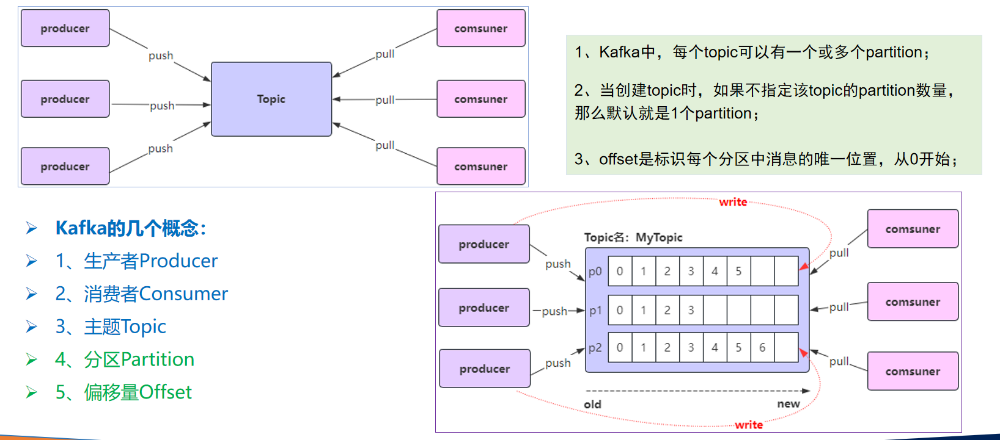

# Kafka

Apache Kafka是一款由Apache软件基金会开发的**高吞吐量、分布式、可扩展的流处理平台**，主要用于构建实时数据管道和大规模数据处理系统。以下是从学习角度为你整理的核心知识框架：

---

### 一、核心概念与架构
1. **基础定义**  
   Kafka是一个**发布-订阅消息系统**，采用分布式集群架构，支持：
    - **高吞吐**：普通硬件即可支持每秒百万级消息处理
    - **持久化存储**：通过O(1)磁盘数据结构实现TB级数据稳定存储
    - **水平扩展**：通过分区（Partition）和副本（Replica）机制支持横向扩容

2. **核心组件**
    - **Broker**：集群中的服务器节点，负责数据存储与传输
    - **Topic**：消息的逻辑分类，每个Topic可划分为多个分区（Partition）以实现并行处理
    - **Producer/Consumer**：生产者发布消息到Topic，消费者订阅并消费消息
    - **Consumer Group**：消费者组实现负载均衡，同一组内消费者共享消费进度

3. **设计特点**
    - **顺序读写与零拷贝**：通过磁盘顺序追加写入（Append-only）和零拷贝技术（Zero-copy）提升性能
    - **副本容错**：每个分区的数据在多台Broker上备份，Leader节点故障时自动切换
    - **消息保留策略**：支持按时间或数据量保留消息，默认保留7天

---

### 二、典型应用场景
1. **实时数据处理**
    - 电商订单处理（如库存实时扣减、支付状态同步）
    - 金融交易流水分析（如风控实时监控）

2. **日志聚合与分析**
    - 收集多服务器日志（如Nginx访问日志、应用错误日志），集中存储至Elasticsearch或Hadoop

3. **系统解耦与异步通信**
    - 微服务架构中，解耦服务间依赖（如订单服务与通知服务的异步通信）

4. **用户行为追踪**
    - 记录用户在网站/APP的点击、搜索等行为，用于个性化推荐与用户画像构建

---

### 三、技术特性与优势
| 特性                | 说明                                                                 |
|---------------------|--------------------------------------------------------------------|
| 高吞吐量            | 单机支持每秒数十万至百万级消息处理                          |
| 低延迟              | 端到端延迟可控制在毫秒级                                       |
| 持久化存储          | 数据默认持久化到磁盘，支持TB级存储                          |
| 可扩展性            | 通过增加Broker和分区实现水平扩展                           |
| 容错性              | 副本机制保障数据不丢失，节点故障自动恢复                    |

---

### 四、学习建议
1. **入门路径**
    - **第一步**：理解核心术语（Topic/Partition/Offset/Consumer Group）
    - **第二步**：本地搭建单节点Kafka环境，练习消息生产和消费
    - **第三步**：学习Kafka Streams或与Flink/Spark集成实现流处理

2. **资源推荐**
    - **官方文档**：[kafka.apache.org](https://kafka.apache.org/documentation/)（含完整API与配置说明）
    - **实践案例**：参考网页6中电商系统的解耦设计

---

### 五、扩展知识
- **名字由来**：开发者Jay Kreps因喜爱作家Franz Kafka而命名，与功能无关
- **版本迭代**：截至2024年12月，最新稳定版本为3.8.0（注意版本差异对API的影响）

---

下一步可深入探索Kafka的**生产者/消费者API编程**或**集群部署实践**。需要具体案例分析时，可随时告知！


---

以下是关于Kafka操作的综合介绍，涵盖核心操作流程、关键配置及最佳实践：

---

### 一、核心操作流程
#### 1. **环境搭建与启动**
- **依赖安装**  
  需先安装JDK（推荐JDK 1.8+）和Zookeeper（Kafka 3.0+版本已内置Zookeeper，可无需单独安装）。
- **Kafka安装**  
  从[官网](https://kafka.apache.org/downloads)下载安装包，解压后配置`server.properties`：
  ```properties
  broker.id=0  # 唯一Broker标识
  listeners=PLAINTEXT://:9092  # 监听地址
  log.dirs=/tmp/kafka-logs  # 日志存储路径
  zookeeper.connect=localhost:2181  # Zookeeper地址
  ```
- **服务启动**  
  依次启动Zookeeper和Kafka：
  ```bash
  # 启动Zookeeper（若使用内置）
  bin/zookeeper-server-start.sh config/zookeeper.properties
  # 启动Kafka Broker
  bin/kafka-server-start.sh config/server.properties
  ```

#### 2. **Topic管理**
- **创建Topic**  
  指定分区数和副本因子：
  ```bash
  bin/kafka-topics.sh --create --topic orders --bootstrap-server localhost:9092 \
  --partitions 3 --replication-factor 1
  ```
- **查看Topic列表**
  ```bash
  bin/kafka-topics.sh --list --bootstrap-server localhost:9092
  ```
- **删除Topic**
  ```bash
  bin/kafka-topics.sh --delete --topic orders --bootstrap-server localhost:9092
  ```

#### 3. **生产者操作**
- **命令行生产消息**
  ```bash
  bin/kafka-console-producer.sh --topic orders --bootstrap-server localhost:9092
  ```
- **Java生产者示例**  
  需配置`bootstrap.servers`和序列化器：
  ```java
  Properties props = new Properties();
  props.put("bootstrap.servers", "localhost:9092");
  props.put("key.serializer", "org.apache.kafka.common.serialization.StringSerializer");
  props.put("value.serializer", "org.apache.kafka.common.serialization.StringSerializer");
  
  Producer<String, String> producer = new KafkaProducer<>(props);
  ProducerRecord<String, String> record = new ProducerRecord<>("orders", "order_001", "1000元");
  producer.send(record, (metadata, e) -> {
      if (e != null) System.err.println("发送失败: " + e.getMessage());
      else System.out.println("写入分区: " + metadata.partition());
  });
  producer.close();
  ```
  同步发送使用`send().get()`，异步发送通过回调处理结果。

#### 4. **消费者操作**
- **命令行消费消息**
  ```bash
  bin/kafka-console-consumer.sh --topic orders --bootstrap-server localhost:9092 --from-beginning
  ```
- **Java消费者示例**  
  配置消费者组和反序列化器：
  ```java
  Properties props = new Properties();
  props.put("bootstrap.servers", "localhost:9092");
  props.put("group.id", "payment-service");
  props.put("key.deserializer", "org.apache.kafka.common.serialization.StringDeserializer");
  props.put("value.deserializer", "org.apache.kafka.common.serialization.StringDeserializer");
  props.put("auto.offset.reset", "earliest");  // 从最早消息开始消费
  
  KafkaConsumer<String, String> consumer = new KafkaConsumer<>(props);
  consumer.subscribe(Collections.singletonList("orders"));
  
  while (true) {
      ConsumerRecords<String, String> records = consumer.poll(Duration.ofMillis(100));
      for (ConsumerRecord<String, String> record : records) {
          System.out.printf("收到订单: key=%s, value=%s%n", record.key(), record.value());
      }
      consumer.commitAsync();  // 手动提交偏移量
  }
  ```

---

### 二、关键配置与优化
#### 1. **生产者配置**
| 参数 | 作用 | 推荐值 |  
|------|------|-------|
| `acks` | 消息确认机制 | `all`（最高可靠性） |  
| `retries` | 发送失败重试次数 | 3-5 |  
| `batch.size` | 批量发送大小 | 16384（16KB） |  
| `linger.ms` | 发送等待时间 | 20-100ms |  

**最佳实践**：异步发送+回调处理，平衡吞吐与可靠性。

#### 2. **消费者配置**
| 参数 | 作用 | 推荐值 |  
|------|------|-------|
| `enable.auto.commit` | 自动提交偏移量 | `false`（手动提交） |  
| `max.poll.records` | 单次poll最大消息数 | 500 |  
| `session.timeout.ms` | 消费者会话超时 | 10000ms |  
| `fetch.min.bytes` | 最小拉取字节数 | 1 |  

**消费模式**：
- **订阅模式**（`subscribe()`）：自动负载均衡，适合动态消费者组。
- **指定分区**（`assign()`）：精确控制，需自行处理分区变化。

---

### 三、高级操作场景
#### 1. **消费者组管理**
- **查看消费者组状态**
  ```bash
  bin/kafka-consumer-groups.sh --list --bootstrap-server localhost:9092
  bin/kafka-consumer-groups.sh --describe --group payment-service --bootstrap-server localhost:9092
  ```
- **重置偏移量**
  ```bash
  bin/kafka-consumer-groups.sh --reset-offsets --to-earliest --topic orders --execute \
  --bootstrap-server localhost:9092 --group payment-service
  ```

#### 2. **数据可靠性保障**
- **副本机制**：通过`replication.factor`设置副本数（建议≥3）。
- **ISR机制**：仅同步副本（In-Sync Replicas）参与写入确认。

#### 3. **性能调优**
- **分区数规划**：分区数=消费者组内消费者数量×2（避免资源闲置）。
- **JVM参数优化**：调整堆内存（`-Xmx4G -Xms4G`）和GC算法（G1）。

---

### 四、典型应用场景
1. **日志收集**：Flume采集日志写入Kafka，供ELK分析。
2. **实时流处理**：与Flink/Spark Streaming集成，处理交易数据。
3. **系统解耦**：微服务间通过Kafka异步通信，如订单与库存服务。

---

### 参考资料
: Kafka核心架构与概念
: 生产者与消费者操作
: 性能调优与高级配置
: 实际应用场景与案例

---

以下是关于在Kafka中创建Topic的详细指南，综合了不同场景下的操作方式和注意事项：

---

### 一、创建Topic的三种核心方式
#### 1. **命令行工具（推荐）**
使用`kafka-topics.sh`脚本创建，支持灵活配置分区和副本参数：
```bash
./kafka-topics.sh --create \
  --bootstrap-server localhost:9092 \  # Kafka Broker地址
  --topic my-topic \                  # Topic名称（需唯一）
  --partitions 3 \                   # 分区数（建议≤200）
  --replication-factor 2             # 副本数（≤Broker节点数）
```
**参数说明**：
- `--partitions`：分区数决定Topic的并行处理能力，需根据消费者数量和吞吐量需求设置
- `--replication-factor`：副本数影响数据可靠性，生产环境建议≥3
- 高版本Kafka（≥2.2）需用`--bootstrap-server`替代`--zookeeper`

#### 2. **Java API编程**
通过`AdminClient`实现动态创建，适合自动化场景：
```java
Properties props = new Properties();
props.put(AdminClientConfig.BOOTSTRAP_SERVERS_CONFIG, "localhost:9092");
AdminClient admin = AdminClient.create(props);

NewTopic newTopic = new NewTopic("my-topic", 3, (short) 2);
CreateTopicsResult result = admin.createTopics(Collections.singleton(newTopic));
result.all().get(); // 阻塞等待创建完成
admin.close();
```
**注意事项**：
- 需添加Maven依赖`kafka-clients`（版本需与Kafka服务端一致）
- 异常处理需捕获`InterruptedException`和`ExecutionException`

#### 3. **管理控制台（云服务场景）**
适用于阿里云、华为云等托管Kafka服务：
1. 登录云服务控制台，进入Kafka实例详情页
2. 导航至「Topic管理」→「创建Topic」
3. 填写名称、分区数、副本因子等参数（部分参数受实例规格限制）

---

### 二、关键配置与注意事项
#### 1. **命名规范**
- 避免特殊字符（如`#`开头可能导致监控异常）
- 区分大小写，但Kafka内部会统一转为小写
- 禁止仅用句点和下划线区分的重复名称（如`topic_1`和`topic.1`冲突）

#### 2. **参数选择策略**
| 参数               | 推荐值                  | 说明                                                                 |
|--------------------|-------------------------|--------------------------------------------------------------------|
| 分区数             | 消费者数量×2~3           | 过多分区会增加ZooKeeper负载，建议单Topic≤200               |
| 副本因子           | 生产环境≥3               | 需≤Broker节点数，确保数据高可用                           |
| 消息保留时间       | 按业务需求（默认72小时） | 通过`log.retention.hours`配置                                |
| 自动创建Topic      | 生产环境关闭             | 避免非预期Topic占用资源（配置`auto.create.topics.enable=false`） |

#### 3. **权限控制**
- 开启密文接入时，需配置ACL策略（默认用户可创建，其他用户需授权）
- 使用SASL/SSL认证的场景需在客户端配置认证信息

---

### 三、创建后的管理操作
1. **查看Topic列表**
   ```bash
   ./kafka-topics.sh --list --bootstrap-server localhost:9092
   ```
2. **查看详细信息**
   ```bash
   ./kafka-topics.sh --describe --topic my-topic --bootstrap-server localhost:9092
   ```
3. **删除Topic**
   ```bash
   ./kafka-topics.sh --delete --topic my-topic --bootstrap-server localhost:9092
   ```
   需确保服务端配置`delete.topic.enable=true`

4. **修改配置**
   ```bash
   ./kafka-configs.sh --alter --entity-type topics --entity-name my-topic \
   --add-config max.message.bytes=10485760 --bootstrap-server localhost:9092
   ```

---

### 四、常见问题解决
1. **分区数不足导致性能瓶颈**
   - 通过`kafka-topics.sh --alter`动态扩容分区
   - 需注意分区重平衡可能导致短暂消费延迟

2. **副本同步失败（ISR机制）**
   - 检查网络连通性和磁盘空间
   - 监控`UnderReplicatedPartitions`指标

3. **自动创建Topic参数不合理**
   - 修改`num.partitions`和`default.replication.factor`默认值

---

通过合理配置Topic参数并结合业务场景选择创建方式，可有效提升Kafka集群的稳定性和处理能力。建议初次使用优先通过命令行工具验证，生产环境采用API或自动化平台集成。


---

以下是使用 `kafka-console-producer.sh` 向 Kafka 主题（Topic）写入事件（Events）的完整指南，综合多个场景的操作方法与优化技巧：

---

### 一、基础操作：手动输入事件
#### 1. **启动生产者并写入事件**
通过命令行工具直接向指定主题发送文本消息：
```bash
./kafka-console-producer.sh \
  --bootstrap-server localhost:9092 \  # Kafka Broker地址
  --topic orders                       # 目标主题名称
```
- **操作流程**：
    1. 执行命令后进入交互式输入模式；
    2. 逐行输入事件内容（如 `{"order_id": 1001, "amount": 200}`），按回车发送；
    3. 按 `Ctrl+C` 退出生产者。

#### 2. **带键值对的事件写入**
通过指定键值分隔符发送结构化数据：
```bash
./kafka-console-producer.sh \
  --bootstrap-server localhost:9092 \
  --topic user_actions \
  --property "parse.key=true" \        # 启用键解析
  --property "key.separator=:"         # 键值分隔符（例如 key1:value1）
```
- **示例输入**：
  ```text
  user123:{"action": "login", "time": "2025-05-08T10:00:00"}
  user456:{"action": "purchase", "item": "book"}
  ```

---

### 二、批量导入：从文件写入事件
#### 1. **直接导入文本文件**
将文件内容逐行发送到主题：
```bash
./kafka-console-producer.sh \
  --bootstrap-server localhost:9092 \
  --topic logs \
  --file /path/to/logfile.txt          # 文件路径
```
- **文件格式要求**：每行一个独立事件（支持纯文本或 JSON 格式）。

#### 2. **自定义编码与格式**
处理特殊编码文件或指定数据格式：
```bash
./kafka-console-producer.sh \
  --bootstrap-server node1:9092 \
  --topic csv_data \
  --property "file.encoding=UTF-8" \    # 文件编码
  --property "format.type=csv"         # 数据格式（如 CSV）
```

---

### 三、高级配置：性能优化与可靠性
#### 1. **提升吞吐量**
通过批量发送和压缩减少网络开销：
```bash
./kafka-console-producer.sh \
  --bootstrap-server localhost:9092 \
  --topic high_throughput \
  --producer-property "batch.size=16384" \     # 批量大小（16KB）
  --producer-property "linger.ms=50" \         # 等待时间（毫秒）
  --producer-property "compression.type=gzip"  # 压缩算法
```

#### 2. **可靠性配置**
平衡数据一致性与性能：
```bash
./kafka-console-producer.sh \
  --bootstrap-server localhost:9092 \
  --topic financial_txns \
  --producer-property "acks=all" \       # 等待所有副本确认
  --producer-property "retries=5"       # 失败重试次数
```

---

### 四、分区控制策略
#### 1. **通过键（Key）分配分区**
相同键的事件自动分配到同一分区，保证顺序性：
```bash
./kafka-console-producer.sh \
  --bootstrap-server localhost:9092 \
  --topic partitioned_events \
  --property "parse.key=true" \
  --property "key.separator=:" 
```
- **示例**：键为用户ID（如 `user123:event_data`）。

#### 2. **手动指定分区**
精确控制事件写入的分区号：
```bash
./kafka-console-producer.sh \
  --bootstrap-server localhost:9092 \
  --topic sensor_data \
  --property "partitioner.class=org.apache.kafka.clients.producer.RoundRobinPartitioner"
```

---

### 五、验证与调试
#### 1. **实时消费验证**
启动消费者查看写入结果：
```bash
./kafka-console-consumer.sh \
  --bootstrap-server localhost:9092 \
  --topic orders \
  --from-beginning                     # 从头读取历史事件
```

#### 2. **查看主题元数据**
确认事件分布与分区状态：
```bash
./kafka-topics.sh --describe \
  --topic orders \
  --bootstrap-server localhost:9092    # 显示分区与副本信息
```

---

### 注意事项
1. **版本兼容性**：
    - Kafka 2.2+ 使用 `--bootstrap-server` 参数，旧版本需替换为 `--broker-list`；
    - 若使用 Zookeeper 地址（旧版），需替换为 `--zookeeper localhost:2181`。

2. **文件编码问题**：非 UTF-8 文件需指定 `--property file.encoding=GBK` 等参数。

3. **生产环境建议**：避免直接暴露 Broker IP，建议通过 SASL/SSL 加密传输。

---

通过上述方法，可灵活适应不同场景的事件写入需求。若需集成代码实现自动化生产，可参考 Spring Boot 的 `KafkaTemplate` 示例。

---


以下是 Kafka 核心概念的详细解析：



---

### 一、生产者（Producer）
**定义**：生产者是向 Kafka 主题发送消息的客户端程序，负责将数据发布到 Kafka 集群中。  
**核心功能**：
1. **消息发送**：支持同步、异步和发送并忘记（Fire-and-Forget）三种模式，通过 `send()` 方法发送消息。
2. **分区选择**：
    - 显式指定分区（如 `new ProducerRecord("topic", 0, key, value)`）。
    - 基于 Key 哈希（相同 Key 的消息分配到同一分区，保证顺序性）。
    - 轮询策略（默认未指定 Key 时使用）。
3. **可靠性保障**：
    - `acks` 参数控制确认机制：`0`（不等待）、`1`（仅 Leader 确认）、`all`（所有副本确认）。
    - `retries` 和 `batch.size` 优化吞吐量与容错性。

---

### 二、消费者（Consumer）
**定义**：消费者是从 Kafka 主题读取消息的客户端程序，通过订阅主题并按顺序处理消息。  
**核心机制**：
1. **消费者组**：
    - 同一消费者组内的消费者共享主题订阅，每个分区仅由一个消费者处理，实现负载均衡。
    - 若消费者数量超过分区数，部分消费者会闲置。
2. **偏移量管理**：
    - 消费者通过记录分区的 `Offset`（偏移量）跟踪消费进度，支持自动提交或手动提交。
    - 消费者故障时，通过 `auto.offset.reset` 配置重置偏移量（如 `earliest` 或 `latest`）。
3. **消息拉取**：
    - 使用 `poll()` 方法批量拉取消息，参数 `max.poll.records` 控制单次拉取量。

---

### 三、主题（Topic）
**定义**：主题是消息的逻辑分类单元，用于区分不同类型的数据流（如订单、日志等）。  
**特点**：
1. **分区设计**：
    - 每个主题可划分为多个分区（Partition），分区是物理存储单元，消息按顺序追加到分区日志中。
    - 分区数决定并行处理能力，建议与消费者数量匹配（如消费者数×2）。
2. **副本机制**：
    - 每个分区有多个副本（Replica），Leader 负责读写，Follower 异步同步数据。
    - 副本因子（Replication Factor）保障数据高可用性（生产环境建议≥3）。

---

### 四、分区（Partition）
**定义**：分区是主题的物理分片，每个分区在磁盘上表现为一个有序的日志文件。  
**核心作用**：
1. **扩展性**：分区分布在多个 Broker 上，支持横向扩展存储和处理能力。
2. **顺序性保障**：
    - 同一分区内的消息按写入顺序存储，消费者按顺序读取。
    - 全局顺序性需将分区数设为 1（但会牺牲并行性）。
3. **Segment 机制**：
    - 分区被切分为多个 Segment 文件（`.log` 存储数据，`.index` 存储稀疏索引），避免单个文件过大。

---

### 五、偏移量（Offset）
**定义**：偏移量是分区内每条消息的唯一标识符，从 0 开始递增。  
**功能与分类**：
1. **生产者偏移量（LEO）**：
    - 表示生产者写入的最新消息位置（Log End Offset）。
2. **消费者偏移量**：
    - 记录消费者已处理的最新消息位置，存储在内部主题 `__consumer_offsets` 中。
    - 支持手动重置以实现消息回溯或跳过特定数据。
3. **容错与幂等性**：
    - 消费者故障后，通过偏移量恢复消费位置，避免重复处理或遗漏消息。

---

### 总结与关系
- **生产者 → 主题**：生产者将消息按策略分发到主题的分区中。
- **主题 → 分区**：通过分区实现数据分片与并行处理。
- **消费者 → 分区**：消费者组通过分区分配策略实现负载均衡。
- **偏移量 → 可靠性**：通过管理偏移量保障消息顺序性和消费进度。

---

以上概念共同构成 Kafka 高吞吐、分布式消息系统的核心架构，适用于日志收集、实时流处理等场景。

---

默认情况下，当启动一个新的消费者组时，它会从每个分区的最新偏移量（即该分区中最后一条消息的下一个位置）开始消费。如果希望从第一条消息开始消费，需要将消费者的auto.offset.reset设置为earliest；

注意： 如果之前已经用相同的消费者组ID消费过该主题，并且Kafka已经保存了该消费者组的偏移量，那么即使你设置了auto.offset.reset=earliest，该设置也不会生效，因为Kafka只会在找不到偏移量时使用这个配置。在这种情况下，你需要手动重置偏移量或使用一个新的消费者组ID；


---


# 消息消费时偏移量策略的配置

```yml
spring:
  kafka:
    consumer:
      auto-offset-reset: earliest
```
取值：`earliest`、`latest`、`none`、`exception`
- earliest：自动将偏移量重置为最早的偏移量；
- latest：自动将偏移量重置为最新偏移量；
- none：如果没有为消费者组找到以前的偏移量，则向消费者抛出异常；
- exception：向消费者抛出异常；（spring-kafka不支持）

---


