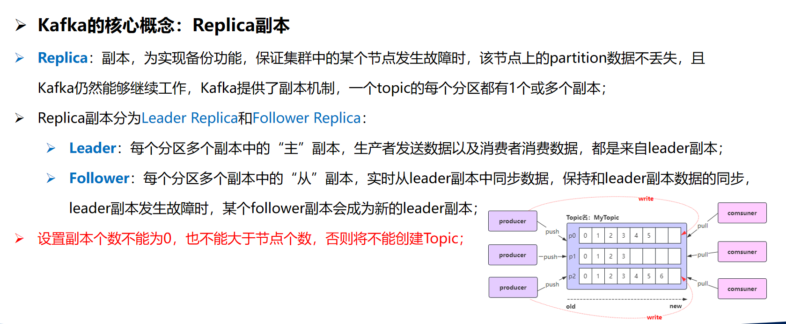

# Kafka

Apache Kafka是一款由Apache软件基金会开发的**高吞吐量、分布式、可扩展的流处理平台**，主要用于构建实时数据管道和大规模数据处理系统。以下是从学习角度为你整理的核心知识框架：

---

### 一、核心概念与架构
1. **基础定义**  
   Kafka是一个**发布-订阅消息系统**，采用分布式集群架构，支持：
    - **高吞吐**：普通硬件即可支持每秒百万级消息处理
    - **持久化存储**：通过O(1)磁盘数据结构实现TB级数据稳定存储
    - **水平扩展**：通过分区（Partition）和副本（Replica）机制支持横向扩容

2. **核心组件**
    - **Broker**：集群中的服务器节点，负责数据存储与传输
    - **Topic**：消息的逻辑分类，每个Topic可划分为多个分区（Partition）以实现并行处理
    - **Producer/Consumer**：生产者发布消息到Topic，消费者订阅并消费消息
    - **Consumer Group**：消费者组实现负载均衡，同一组内消费者共享消费进度

3. **设计特点**
    - **顺序读写与零拷贝**：通过磁盘顺序追加写入（Append-only）和零拷贝技术（Zero-copy）提升性能
    - **副本容错**：每个分区的数据在多台Broker上备份，Leader节点故障时自动切换
    - **消息保留策略**：支持按时间或数据量保留消息，默认保留7天

---

### 二、典型应用场景
1. **实时数据处理**
    - 电商订单处理（如库存实时扣减、支付状态同步）
    - 金融交易流水分析（如风控实时监控）

2. **日志聚合与分析**
    - 收集多服务器日志（如Nginx访问日志、应用错误日志），集中存储至Elasticsearch或Hadoop

3. **系统解耦与异步通信**
    - 微服务架构中，解耦服务间依赖（如订单服务与通知服务的异步通信）

4. **用户行为追踪**
    - 记录用户在网站/APP的点击、搜索等行为，用于个性化推荐与用户画像构建

---

### 三、技术特性与优势
| 特性                | 说明                                                                 |
|---------------------|--------------------------------------------------------------------|
| 高吞吐量            | 单机支持每秒数十万至百万级消息处理                          |
| 低延迟              | 端到端延迟可控制在毫秒级                                       |
| 持久化存储          | 数据默认持久化到磁盘，支持TB级存储                          |
| 可扩展性            | 通过增加Broker和分区实现水平扩展                           |
| 容错性              | 副本机制保障数据不丢失，节点故障自动恢复                    |

---

### 四、学习建议
1. **入门路径**
    - **第一步**：理解核心术语（Topic/Partition/Offset/Consumer Group）
    - **第二步**：本地搭建单节点Kafka环境，练习消息生产和消费
    - **第三步**：学习Kafka Streams或与Flink/Spark集成实现流处理

2. **资源推荐**
    - **官方文档**：[kafka.apache.org](https://kafka.apache.org/documentation/)（含完整API与配置说明）
    - **实践案例**：参考网页6中电商系统的解耦设计

---

### 五、扩展知识
- **名字由来**：开发者Jay Kreps因喜爱作家Franz Kafka而命名，与功能无关
- **版本迭代**：截至2024年12月，最新稳定版本为3.8.0（注意版本差异对API的影响）

---

下一步可深入探索Kafka的**生产者/消费者API编程**或**集群部署实践**。需要具体案例分析时，可随时告知！


---

以下是关于Kafka操作的综合介绍，涵盖核心操作流程、关键配置及最佳实践：

---

### 一、核心操作流程
#### 1. **环境搭建与启动**
- **依赖安装**  
  需先安装JDK（推荐JDK 1.8+）和Zookeeper（Kafka 3.0+版本已内置Zookeeper，可无需单独安装）。
- **Kafka安装**  
  从[官网](https://kafka.apache.org/downloads)下载安装包，解压后配置`server.properties`：
  ```properties
  broker.id=0  # 唯一Broker标识
  listeners=PLAINTEXT://:9092  # 监听地址
  log.dirs=/tmp/kafka-logs  # 日志存储路径
  zookeeper.connect=localhost:2181  # Zookeeper地址
  ```
- **服务启动**  
  依次启动Zookeeper和Kafka：
  ```bash
  # 启动Zookeeper（若使用内置）
  bin/zookeeper-server-start.sh config/zookeeper.properties
  # 启动Kafka Broker
  bin/kafka-server-start.sh config/server.properties
  ```

#### 2. **Topic管理**
- **创建Topic**  
  指定分区数和副本因子：
  ```bash
  bin/kafka-topics.sh --create --topic orders --bootstrap-server localhost:9092 \
  --partitions 3 --replication-factor 1
  ```
- **查看Topic列表**
  ```bash
  bin/kafka-topics.sh --list --bootstrap-server localhost:9092
  ```
- **删除Topic**
  ```bash
  bin/kafka-topics.sh --delete --topic orders --bootstrap-server localhost:9092
  ```

#### 3. **生产者操作**
- **命令行生产消息**
  ```bash
  bin/kafka-console-producer.sh --topic orders --bootstrap-server localhost:9092
  ```
- **Java生产者示例**  
  需配置`bootstrap.servers`和序列化器：
  ```java
  Properties props = new Properties();
  props.put("bootstrap.servers", "localhost:9092");
  props.put("key.serializer", "org.apache.kafka.common.serialization.StringSerializer");
  props.put("value.serializer", "org.apache.kafka.common.serialization.StringSerializer");
  
  Producer<String, String> producer = new KafkaProducer<>(props);
  ProducerRecord<String, String> record = new ProducerRecord<>("orders", "order_001", "1000元");
  producer.send(record, (metadata, e) -> {
      if (e != null) System.err.println("发送失败: " + e.getMessage());
      else System.out.println("写入分区: " + metadata.partition());
  });
  producer.close();
  ```
  同步发送使用`send().get()`，异步发送通过回调处理结果。

#### 4. **消费者操作**
- **命令行消费消息**
  ```bash
  bin/kafka-console-consumer.sh --topic orders --bootstrap-server localhost:9092 --from-beginning
  ```
- **Java消费者示例**  
  配置消费者组和反序列化器：
  ```java
  Properties props = new Properties();
  props.put("bootstrap.servers", "localhost:9092");
  props.put("group.id", "payment-service");
  props.put("key.deserializer", "org.apache.kafka.common.serialization.StringDeserializer");
  props.put("value.deserializer", "org.apache.kafka.common.serialization.StringDeserializer");
  props.put("auto.offset.reset", "earliest");  // 从最早消息开始消费
  
  KafkaConsumer<String, String> consumer = new KafkaConsumer<>(props);
  consumer.subscribe(Collections.singletonList("orders"));
  
  while (true) {
      ConsumerRecords<String, String> records = consumer.poll(Duration.ofMillis(100));
      for (ConsumerRecord<String, String> record : records) {
          System.out.printf("收到订单: key=%s, value=%s%n", record.key(), record.value());
      }
      consumer.commitAsync();  // 手动提交偏移量
  }
  ```

---

### 二、关键配置与优化
#### 1. **生产者配置**
| 参数 | 作用 | 推荐值 |  
|------|------|-------|
| `acks` | 消息确认机制 | `all`（最高可靠性） |  
| `retries` | 发送失败重试次数 | 3-5 |  
| `batch.size` | 批量发送大小 | 16384（16KB） |  
| `linger.ms` | 发送等待时间 | 20-100ms |  

**最佳实践**：异步发送+回调处理，平衡吞吐与可靠性。

#### 2. **消费者配置**
| 参数 | 作用 | 推荐值 |  
|------|------|-------|
| `enable.auto.commit` | 自动提交偏移量 | `false`（手动提交） |  
| `max.poll.records` | 单次poll最大消息数 | 500 |  
| `session.timeout.ms` | 消费者会话超时 | 10000ms |  
| `fetch.min.bytes` | 最小拉取字节数 | 1 |  

**消费模式**：
- **订阅模式**（`subscribe()`）：自动负载均衡，适合动态消费者组。
- **指定分区**（`assign()`）：精确控制，需自行处理分区变化。

---

### 三、高级操作场景
#### 1. **消费者组管理**
- **查看消费者组状态**
  ```bash
  bin/kafka-consumer-groups.sh --list --bootstrap-server localhost:9092
  bin/kafka-consumer-groups.sh --describe --group payment-service --bootstrap-server localhost:9092
  ```
- **重置偏移量**
  ```bash
  bin/kafka-consumer-groups.sh --reset-offsets --to-earliest --topic orders --execute \
  --bootstrap-server localhost:9092 --group payment-service
  ```

#### 2. **数据可靠性保障**
- **副本机制**：通过`replication.factor`设置副本数（建议≥3）。
- **ISR机制**：仅同步副本（In-Sync Replicas）参与写入确认。

#### 3. **性能调优**
- **分区数规划**：分区数=消费者组内消费者数量×2（避免资源闲置）。
- **JVM参数优化**：调整堆内存（`-Xmx4G -Xms4G`）和GC算法（G1）。

---

### 四、典型应用场景
1. **日志收集**：Flume采集日志写入Kafka，供ELK分析。
2. **实时流处理**：与Flink/Spark Streaming集成，处理交易数据。
3. **系统解耦**：微服务间通过Kafka异步通信，如订单与库存服务。

---

### 参考资料
: Kafka核心架构与概念
: 生产者与消费者操作
: 性能调优与高级配置
: 实际应用场景与案例

---

以下是关于在Kafka中创建Topic的详细指南，综合了不同场景下的操作方式和注意事项：

---

### 一、创建Topic的三种核心方式
#### 1. **命令行工具（推荐）**
使用`kafka-topics.sh`脚本创建，支持灵活配置分区和副本参数：
```bash
./kafka-topics.sh --create \
  --bootstrap-server localhost:9092 \  # Kafka Broker地址
  --topic my-topic \                  # Topic名称（需唯一）
  --partitions 3 \                   # 分区数（建议≤200）
  --replication-factor 2             # 副本数（≤Broker节点数）
```
**参数说明**：
- `--partitions`：分区数决定Topic的并行处理能力，需根据消费者数量和吞吐量需求设置
- `--replication-factor`：副本数影响数据可靠性，生产环境建议≥3
- 高版本Kafka（≥2.2）需用`--bootstrap-server`替代`--zookeeper`

#### 2. **Java API编程**
通过`AdminClient`实现动态创建，适合自动化场景：
```java
Properties props = new Properties();
props.put(AdminClientConfig.BOOTSTRAP_SERVERS_CONFIG, "localhost:9092");
AdminClient admin = AdminClient.create(props);

NewTopic newTopic = new NewTopic("my-topic", 3, (short) 2);
CreateTopicsResult result = admin.createTopics(Collections.singleton(newTopic));
result.all().get(); // 阻塞等待创建完成
admin.close();
```
**注意事项**：
- 需添加Maven依赖`kafka-clients`（版本需与Kafka服务端一致）
- 异常处理需捕获`InterruptedException`和`ExecutionException`

#### 3. **管理控制台（云服务场景）**
适用于阿里云、华为云等托管Kafka服务：
1. 登录云服务控制台，进入Kafka实例详情页
2. 导航至「Topic管理」→「创建Topic」
3. 填写名称、分区数、副本因子等参数（部分参数受实例规格限制）

---

### 二、关键配置与注意事项
#### 1. **命名规范**
- 避免特殊字符（如`#`开头可能导致监控异常）
- 区分大小写，但Kafka内部会统一转为小写
- 禁止仅用句点和下划线区分的重复名称（如`topic_1`和`topic.1`冲突）

#### 2. **参数选择策略**
| 参数               | 推荐值                  | 说明                                                                 |
|--------------------|-------------------------|--------------------------------------------------------------------|
| 分区数             | 消费者数量×2~3           | 过多分区会增加ZooKeeper负载，建议单Topic≤200               |
| 副本因子           | 生产环境≥3               | 需≤Broker节点数，确保数据高可用                           |
| 消息保留时间       | 按业务需求（默认72小时） | 通过`log.retention.hours`配置                                |
| 自动创建Topic      | 生产环境关闭             | 避免非预期Topic占用资源（配置`auto.create.topics.enable=false`） |

#### 3. **权限控制**
- 开启密文接入时，需配置ACL策略（默认用户可创建，其他用户需授权）
- 使用SASL/SSL认证的场景需在客户端配置认证信息

---

### 三、创建后的管理操作
1. **查看Topic列表**
   ```bash
   ./kafka-topics.sh --list --bootstrap-server localhost:9092
   ```
2. **查看详细信息**
   ```bash
   ./kafka-topics.sh --describe --topic my-topic --bootstrap-server localhost:9092
   ```
3. **删除Topic**
   ```bash
   ./kafka-topics.sh --delete --topic my-topic --bootstrap-server localhost:9092
   ```
   需确保服务端配置`delete.topic.enable=true`

4. **修改配置**
   ```bash
   ./kafka-configs.sh --alter --entity-type topics --entity-name my-topic \
   --add-config max.message.bytes=10485760 --bootstrap-server localhost:9092
   ```

---

### 四、常见问题解决
1. **分区数不足导致性能瓶颈**
   - 通过`kafka-topics.sh --alter`动态扩容分区
   - 需注意分区重平衡可能导致短暂消费延迟

2. **副本同步失败（ISR机制）**
   - 检查网络连通性和磁盘空间
   - 监控`UnderReplicatedPartitions`指标

3. **自动创建Topic参数不合理**
   - 修改`num.partitions`和`default.replication.factor`默认值

---

通过合理配置Topic参数并结合业务场景选择创建方式，可有效提升Kafka集群的稳定性和处理能力。建议初次使用优先通过命令行工具验证，生产环境采用API或自动化平台集成。


---

以下是使用 `kafka-console-producer.sh` 向 Kafka 主题（Topic）写入事件（Events）的完整指南，综合多个场景的操作方法与优化技巧：

---

### 一、基础操作：手动输入事件
#### 1. **启动生产者并写入事件**
通过命令行工具直接向指定主题发送文本消息：
```bash
./kafka-console-producer.sh \
  --bootstrap-server localhost:9092 \  # Kafka Broker地址
  --topic orders                       # 目标主题名称
```
- **操作流程**：
    1. 执行命令后进入交互式输入模式；
    2. 逐行输入事件内容（如 `{"order_id": 1001, "amount": 200}`），按回车发送；
    3. 按 `Ctrl+C` 退出生产者。

#### 2. **带键值对的事件写入**
通过指定键值分隔符发送结构化数据：
```bash
./kafka-console-producer.sh \
  --bootstrap-server localhost:9092 \
  --topic user_actions \
  --property "parse.key=true" \        # 启用键解析
  --property "key.separator=:"         # 键值分隔符（例如 key1:value1）
```
- **示例输入**：
  ```text
  user123:{"action": "login", "time": "2025-05-08T10:00:00"}
  user456:{"action": "purchase", "item": "book"}
  ```

---

### 二、批量导入：从文件写入事件
#### 1. **直接导入文本文件**
将文件内容逐行发送到主题：
```bash
./kafka-console-producer.sh \
  --bootstrap-server localhost:9092 \
  --topic logs \
  --file /path/to/logfile.txt          # 文件路径
```
- **文件格式要求**：每行一个独立事件（支持纯文本或 JSON 格式）。

#### 2. **自定义编码与格式**
处理特殊编码文件或指定数据格式：
```bash
./kafka-console-producer.sh \
  --bootstrap-server node1:9092 \
  --topic csv_data \
  --property "file.encoding=UTF-8" \    # 文件编码
  --property "format.type=csv"         # 数据格式（如 CSV）
```

---

### 三、高级配置：性能优化与可靠性
#### 1. **提升吞吐量**
通过批量发送和压缩减少网络开销：
```bash
./kafka-console-producer.sh \
  --bootstrap-server localhost:9092 \
  --topic high_throughput \
  --producer-property "batch.size=16384" \     # 批量大小（16KB）
  --producer-property "linger.ms=50" \         # 等待时间（毫秒）
  --producer-property "compression.type=gzip"  # 压缩算法
```

#### 2. **可靠性配置**
平衡数据一致性与性能：
```bash
./kafka-console-producer.sh \
  --bootstrap-server localhost:9092 \
  --topic financial_txns \
  --producer-property "acks=all" \       # 等待所有副本确认
  --producer-property "retries=5"       # 失败重试次数
```

---

### 四、分区控制策略
#### 1. **通过键（Key）分配分区**
相同键的事件自动分配到同一分区，保证顺序性：
```bash
./kafka-console-producer.sh \
  --bootstrap-server localhost:9092 \
  --topic partitioned_events \
  --property "parse.key=true" \
  --property "key.separator=:" 
```
- **示例**：键为用户ID（如 `user123:event_data`）。

#### 2. **手动指定分区**
精确控制事件写入的分区号：
```bash
./kafka-console-producer.sh \
  --bootstrap-server localhost:9092 \
  --topic sensor_data \
  --property "partitioner.class=org.apache.kafka.clients.producer.RoundRobinPartitioner"
```

---

### 五、验证与调试
#### 1. **实时消费验证**
启动消费者查看写入结果：
```bash
./kafka-console-consumer.sh \
  --bootstrap-server localhost:9092 \
  --topic orders \
  --from-beginning                     # 从头读取历史事件
```

#### 2. **查看主题元数据**
确认事件分布与分区状态：
```bash
./kafka-topics.sh --describe \
  --topic orders \
  --bootstrap-server localhost:9092    # 显示分区与副本信息
```

---

### 注意事项
1. **版本兼容性**：
    - Kafka 2.2+ 使用 `--bootstrap-server` 参数，旧版本需替换为 `--broker-list`；
    - 若使用 Zookeeper 地址（旧版），需替换为 `--zookeeper localhost:2181`。

2. **文件编码问题**：非 UTF-8 文件需指定 `--property file.encoding=GBK` 等参数。

3. **生产环境建议**：避免直接暴露 Broker IP，建议通过 SASL/SSL 加密传输。

---

通过上述方法，可灵活适应不同场景的事件写入需求。若需集成代码实现自动化生产，可参考 Spring Boot 的 `KafkaTemplate` 示例。

---


以下是 Kafka 核心概念的详细解析：


---

### 一、生产者（Producer）
**定义**：生产者是向 Kafka 主题发送消息的客户端程序，负责将数据发布到 Kafka 集群中。  
**核心功能**：
1. **消息发送**：支持同步、异步和发送并忘记（Fire-and-Forget）三种模式，通过 `send()` 方法发送消息。
2. **分区选择**：
    - 显式指定分区（如 `new ProducerRecord("topic", 0, key, value)`）。
    - 基于 Key 哈希（相同 Key 的消息分配到同一分区，保证顺序性）。
    - 轮询策略（默认未指定 Key 时使用）。
3. **可靠性保障**：
    - `acks` 参数控制确认机制：`0`（不等待）、`1`（仅 Leader 确认）、`all`（所有副本确认）。
    - `retries` 和 `batch.size` 优化吞吐量与容错性。

---

### 二、消费者（Consumer）
**定义**：消费者是从 Kafka 主题读取消息的客户端程序，通过订阅主题并按顺序处理消息。  
**核心机制**：
1. **消费者组**：
    - 同一消费者组内的消费者共享主题订阅，每个分区仅由一个消费者处理，实现负载均衡。
    - 若消费者数量超过分区数，部分消费者会闲置。
2. **偏移量管理**：
    - 消费者通过记录分区的 `Offset`（偏移量）跟踪消费进度，支持自动提交或手动提交。
    - 消费者故障时，通过 `auto.offset.reset` 配置重置偏移量（如 `earliest` 或 `latest`）。
3. **消息拉取**：
    - 使用 `poll()` 方法批量拉取消息，参数 `max.poll.records` 控制单次拉取量。

---

### 三、主题（Topic）
**定义**：主题是消息的逻辑分类单元，用于区分不同类型的数据流（如订单、日志等）。  
**特点**：
1. **分区设计**：
    - 每个主题可划分为多个分区（Partition），分区是物理存储单元，消息按顺序追加到分区日志中。
    - 分区数决定并行处理能力，建议与消费者数量匹配（如消费者数×2）。
2. **副本机制**：
    - 每个分区有多个副本（Replica），Leader 负责读写，Follower 异步同步数据。
    - 副本因子（Replication Factor）保障数据高可用性（生产环境建议≥3）。

---

### 四、分区（Partition）
**定义**：分区是主题的物理分片，每个分区在磁盘上表现为一个有序的日志文件。  
**核心作用**：
1. **扩展性**：分区分布在多个 Broker 上，支持横向扩展存储和处理能力。
2. **顺序性保障**：
    - 同一分区内的消息按写入顺序存储，消费者按顺序读取。
    - 全局顺序性需将分区数设为 1（但会牺牲并行性）。
3. **Segment 机制**：
    - 分区被切分为多个 Segment 文件（`.log` 存储数据，`.index` 存储稀疏索引），避免单个文件过大。

---

### 五、偏移量（Offset）
**定义**：偏移量是分区内每条消息的唯一标识符，从 0 开始递增。  
**功能与分类**：
1. **生产者偏移量（LEO）**：
    - 表示生产者写入的最新消息位置（Log End Offset）。
2. **消费者偏移量**：
    - 记录消费者已处理的最新消息位置，存储在内部主题 `__consumer_offsets` 中。
    - 支持手动重置以实现消息回溯或跳过特定数据。
3. **容错与幂等性**：
    - 消费者故障后，通过偏移量恢复消费位置，避免重复处理或遗漏消息。

---

### 总结与关系
- **生产者 → 主题**：生产者将消息按策略分发到主题的分区中。
- **主题 → 分区**：通过分区实现数据分片与并行处理。
- **消费者 → 分区**：消费者组通过分区分配策略实现负载均衡。
- **偏移量 → 可靠性**：通过管理偏移量保障消息顺序性和消费进度。

---

以上概念共同构成 Kafka 高吞吐、分布式消息系统的核心架构，适用于日志收集、实时流处理等场景。

---

默认情况下，当启动一个新的消费者组时，它会从每个分区的最新偏移量（即该分区中最后一条消息的下一个位置）开始消费。如果希望从第一条消息开始消费，需要将消费者的auto.offset.reset设置为earliest；

注意： 如果之前已经用相同的消费者组ID消费过该主题，并且Kafka已经保存了该消费者组的偏移量，那么即使你设置了auto.offset.reset=earliest，该设置也不会生效，因为Kafka只会在找不到偏移量时使用这个配置。在这种情况下，你需要手动重置偏移量或使用一个新的消费者组ID；


---


# 消息消费时偏移量策略的配置

```yml
spring:
  kafka:
    consumer:
      auto-offset-reset: earliest
```
取值：`earliest`、`latest`、`none`、`exception`
- earliest：自动将偏移量重置为最早的偏移量；
- latest：自动将偏移量重置为最新偏移量；
- none：如果没有为消费者组找到以前的偏移量，则向消费者抛出异常；
- exception：向消费者抛出异常；（spring-kafka不支持）

---

```java
package com.fire.kafkaeasystudy.producer;

import jakarta.annotation.Resource;
import org.apache.kafka.clients.producer.ProducerRecord;
import org.apache.kafka.common.header.Header;
import org.apache.kafka.common.header.Headers;
import org.apache.kafka.common.header.internals.RecordHeaders;
import org.springframework.kafka.core.KafkaTemplate;
import org.springframework.kafka.support.KafkaHeaders;
import org.springframework.kafka.support.SendResult;
import org.springframework.messaging.Message;
import org.springframework.messaging.support.MessageBuilder;
import org.springframework.stereotype.Component;

import java.nio.charset.StandardCharsets;
import java.util.concurrent.CompletableFuture;

@Component
public class EventProducer {

    // 加入了spring-kafka依赖 + .yml配置信息，springboot自动配置好了kafka，自动装配好了KafkaTemplate这个Bean
    @Resource
    private KafkaTemplate<String, String> kafkaTemplate;

    public void sendEvent() {
        kafkaTemplate.send("hello-topic","hello kafka");
    }

    public void sendEvent2(){
        // 通过构建器模式创建Message对象
        Message<String> message = MessageBuilder.withPayload("hello kafka message").setHeader(KafkaHeaders.TOPIC,"test-topic") // 在header中设置topic的名字
                .build();
        kafkaTemplate.send(message);
    }

    public void sendEvent3(){
        // Headers里面是放一些信息(信息是key-value键值对)，到时候消费者接收到该消息后，可以拿到这个Headers里面放的信息
        Headers headers = new RecordHeaders();
        headers.add("phone","133123214".getBytes(StandardCharsets.UTF_8));
        headers.add("orderId","OD123123412441".getBytes(StandardCharsets.UTF_8));
//        public ProducerRecord(String topic, Integer partition, Long timestamp, K key, V value, Iterable< Header > headers) {
        ProducerRecord<String, String> record = new ProducerRecord<>("test-topic-02",0,System.currentTimeMillis(),"k1","hello kafka",headers);
        kafkaTemplate.send(record);
    }


    public void sendEvent4(){
//        CompletableFuture<SendResult<K, V>> send(String topic, Integer partition, Long timestamp, K key, V data);
        kafkaTemplate.send("test-topic-02",0,System.currentTimeMillis(),"k2","hello kafka");

    }

    public void sendEvent5(){
//        CompletableFuture<SendResult<K, V>> sendDefault(Integer partition, Long timestamp, K key, V data);
//            # 配置模版默认的主题topic名称
//            template:
//                default-topic: default-topic
        kafkaTemplate.sendDefault(0,System.currentTimeMillis(),"k3","hello kafka");
    }


}

```

这段代码展示了使用 Spring Kafka 的 `KafkaTemplate` 发送消息到 Kafka 的多种方法。以下是对各方法的分析及使用注意事项的总结：

---

### **1. 基本发送方法 `sendEvent()`**
- **代码**：`kafkaTemplate.send("hello-topic", "hello kafka");`
- **作用**：向指定主题发送消息，无键、分区或 header。
- **场景**：快速发送简单消息，无需额外配置。

---

### **2. 使用 MessageBuilder `sendEvent2()`**
- **代码**：通过 `MessageBuilder` 构建消息，并在 header 中设置主题。
- **特点**：
    - **Header 指定主题**：消息的主题通过 `KafkaHeaders.TOPIC` 设置，覆盖 `send()` 方法参数（如果存在）。
    - **灵活性**：适合动态主题或需要在消息中携带元数据的场景。
- **注意**：确保 header 中的主题有效。

---

### **3. 使用 ProducerRecord 和 Headers `sendEvent3()`**
- **代码**：构造 `ProducerRecord`，包含自定义 headers、分区、时间戳、键值。
- **关键参数**：
    - **Headers**：添加业务相关元数据（如订单 ID），消费者可通过 `ConsumerRecord.headers()` 获取。
    - **指定分区**：强制消息发送到分区 0，可能引发分区不均（慎用）。
- **场景**：需携带额外信息或精确控制分区/时间戳。

---

### **4. 带分区和时间戳的发送 `sendEvent4()`**
- **代码**：`kafkaTemplate.send("test-topic-02", 0, ...)`
- **行为**：直接指定分区和时间戳，覆盖键的分区计算。
- **注意**：
    - **分区优先级**：显式指定分区时，键的分区路由失效。
    - **适用场景**：确保消息进入特定分区（如顺序性要求）。

---

### **5. 发送到默认主题 `sendEvent5()`**
- **代码**：`kafkaTemplate.sendDefault(...)`
- **前提**：配置 `spring.kafka.template.default-topic`，否则抛出异常。
- **优点**：代码简洁，适合多数消息发送到同一主题。

---

### **关键注意事项**
#### **Headers 的使用**
- **消费者读取**：通过 `@Header(value = "phone") String phone` 或 `ConsumerRecord.headers()` 获取。
- **编码**：Header 值为字节数组，需统一字符编码（如 `StandardCharsets.UTF_8`）。

#### **分区策略**
- **显式分区**：覆盖键的分区路由，可能导致负载不均。若无特殊需求，应避免硬编码分区。
- **键的作用**：未指定分区时，Kafka 根据键哈希选择分区，确保相同键进入同一分区。

#### **时间戳**
- **用途**：日志留存策略、消费者时间窗口处理等。由 Kafka 或应用自定义使用。

#### **异常处理**
- **异步结果**：`send()` 返回 `CompletableFuture`，建议处理异常：
  ```java
  kafkaTemplate.send(...).whenComplete((result, ex) -> {
      if (ex != null) {
          // 处理发送失败
      }
  });
  ```
- **同步发送**：调用 `future.get()` 阻塞等待结果（但影响性能）。

---

### **总结**
- **选择方法**：根据是否需要动态主题、元数据、分区控制等选择合适方法。
- **生产建议**：
    - 避免硬编码分区，优先依赖键的分区路由。
    - 处理发送结果，确保可靠性。
    - 合理使用 headers 传递元数据，而非业务数据。
- **配置**：确保默认主题已配置（若使用 `sendDefault`）。

正确使用这些方法可以灵活高效地集成 Kafka 到 Spring 应用中。


---

# kafkaTemplate.send(...) 和 kafkaTemplate.sendDefault(...) 的区别？

主要区别是发送消息到Kafka时是否每次都需要指定主题topic；

1. kafkaTemplate.send(...) 该方法需要明确地指定要发送消息的目标主题topic；
2. kafkaTemplate.sendDefault() 该方法不需要指定要发送消息的目标主题topic，

- kafkaTemplate.send(...) 方法适用于需要根据业务逻辑或外部输入动态确定消息目标topic的场景;
- kafkaTemplate.sendDefault() 方法适用于总是需要将消息发送到特定默认topic的场景；
- kafkaTemplate.sendDefault() 是一个便捷方法，它使用配置中指定的默认主题topic来发送消息，如果应用中所有消息都发送到同一个主题时采用该方法非常方便，可以减少代码的重复或满足特定的业务需求；


---

# 获取生产者消息发送结果
- .send()方法和.sendDefault()方法都返回CompletableFuture<SendResult<K, V>>；
- CompletableFuture 是Java 8中引入的一个类，用于异步编程，它表示一个异步计算的结果，这个特性使得调用者不必等待操作完成就能继续执行其他任务，从而提高了应用程序的响应速度和吞吐量；


- 因为调用 kafkaTemplate.send() 方法发送消息时，Kafka可能需要一些时间来处理该消息（例如：网络延迟、消息序列化、Kafka集群的负载等），如果 send() 方法是同步的，那么发送消息可能会阻塞调用线程，直到消息发送成功或发生错误，这会导致应用程序的性能下降，尤其是在高并发场景下；
- 使用 CompletableFuture.send() 方法可以立即返回一个表示异步操作结果的未来对象，而不是等待操作完成，这样，调用线程可以继续执行其他任务，而不必等待消息发送完成。当消息发送完成时（无论是成功还是失败），CompletableFuture会相应地更新其状态，并允许我们通过回调、阻塞等方式来获取操作结果；

- 方式一：调用CompletableFuture的get()方法，同步阻塞等待发送结果；
- 方式二：使用 thenAccept(), thenApply(), thenRun() 等方法来注册回调函数，回调函数将在 CompletableFuture 完成时被执行；

---


```java
public void sendEvent8(){
        User user  = User.builder().id(1208).phone("1334124124").birthday(new Date()).build();
        // 分区是null，让kafka自己去决定把消息发到哪个分区

//        producer:
//            value-serializer: org.springframework.kafka.support.serializer.ToStringSerializer
//            value-serializer: org.springframework.kafka.support.serializer.JsonSerializer

//        <dependency>
//            <groupId>com.fasterxml.jackson.core</groupId>
//            <artifactId>jackson-databind</artifactId>
//            <version>2.15.2</version>
//        </dependency>


        kafkaTemplate2.sendDefault(null,System.currentTimeMillis(),"k4",user);
    }
```

针对你的代码和配置，以下是逐步的解决方案：

1. **配置Kafka Producer使用JsonSerializer：**
   在`application.properties`或`application.yml`中设置value-serializer为JsonSerializer，并信任相关包。

   ```properties
   spring.kafka.producer.value-serializer=org.springframework.kafka.support.serializer.JsonSerializer
   spring.kafka.producer.properties.spring.json.trusted.packages=com.yourpackage.model  # 替换为User类的包名
   ```

2. **确保User类可被序列化：**
    - 为User类添加无参构造函数（如果使用Lombok的@Builder，需额外添加@NoArgsConstructor和@AllArgsConstructor）。
    - 示例User类：

      ```java
      import lombok.AllArgsConstructor;
      import lombok.Builder;
      import lombok.NoArgsConstructor;
      import java.util.Date;
 
      @Builder
      @NoArgsConstructor
      @AllArgsConstructor
      public class User {
          private int id;
          private String phone;
          private Date birthday;
          // 省略getter/setter（如果使用Lombok @Data则不需要）
      }
      ```

3. **检查KafkaTemplate配置：**
    - 确认`kafkaTemplate2`已正确配置JsonSerializer，例如：

      ```java
      @Bean
      public KafkaTemplate<String, User> kafkaTemplate2(ProducerFactory<String, User> producerFactory) {
          return new KafkaTemplate<>(producerFactory);
      }
      ```

4. **调整sendDefault方法调用：**
    - 确认参数顺序正确。`sendDefault`可能有不同的重载方法，确保传递的参数匹配方法签名。如果方法需要key和value，应调用：

      ```java
      kafkaTemplate2.sendDefault("k4", user);
      ```

    - 如果需要指定时间戳或分区，使用`send`方法并指定Topic：

      ```java
      kafkaTemplate2.send("your-topic-name", null, System.currentTimeMillis(), "k4", user);
      ```

5. **验证依赖配置：**
    - 确保`pom.xml`中包含必要的Jackson依赖：

      ```xml
      <dependency>
          <groupId>com.fasterxml.jackson.core</groupId>
          <artifactId>jackson-databind</artifactId>
          <version>2.15.2</version>
      </dependency>
      ```

6. **处理日期序列化（可选）：**
    - 如果`Date`类型序列化格式有问题，可以在User类中添加Jackson注解：

      ```java
      import com.fasterxml.jackson.annotation.JsonFormat;
 
      @JsonFormat(shape = JsonFormat.Shape.STRING, pattern = "yyyy-MM-dd HH:mm:ss")
      private Date birthday;
      ```

**最终修正后的代码示例：**

```java
public void sendEvent8() {
    User user = User.builder()
                    .id(1208)
                    .phone("1334124124")
                    .birthday(new Date())
                    .build();
    
    // 使用正确的send方法，假设sendDefault接受key和value
    kafkaTemplate2.sendDefault("k4", user);
    
    // 或明确指定分区、时间戳等
    // kafkaTemplate2.send("your-topic", null, System.currentTimeMillis(), "k4", user);
}
```

**关键点总结：**
- 确保Producer配置使用`JsonSerializer`并信任User类所在包。
- User类需要无参构造器和适当的注解以便Jackson序列化。
- 检查`sendDefault`方法参数是否正确，避免传递多余的参数导致意外行为。
- 验证依赖和KafkaTemplate配置，确保序列化器正确应用。

---

Kafka的**Replica（副本）**是其实现高可用性、容错性和数据一致性的核心机制。以下是其核心概念及工作机制的详细解析：



---

### 一、Replica的定义与作用
1. **基本定义**  
   Replica是Kafka中分区的数据副本，每个分区的数据会被复制到多个Broker上，形成多个副本。例如，若分区配置为3副本（Replication Factor=3），则数据会分布在3个不同的Broker上。

2. **核心作用**
    - **数据冗余**：通过多副本存储，防止单点故障导致数据丢失。
    - **高可用性**：当Leader副本所在的Broker宕机时，Follower副本可接替成为新Leader，保障服务连续性。
    - **负载均衡**：从Kafka 2.4版本开始，Follower副本支持有限度的读请求，分担Leader负载。

---

### 二、Replica的角色与分工
1. **Leader副本**
    - 唯一处理生产者和消费者的读写请求。
    - 负责将数据同步给Follower副本，并维护**ISR（In-Sync Replicas，同步副本集）**。

2. **Follower副本**
    - 通过异步拉取（Pull）方式从Leader同步数据，不直接处理客户端请求（Kafka 2.4前）。
    - 在Leader宕机时，通过选举机制成为新Leader。
    - **Kafka 2.4+**：允许配置Follower副本提供读服务，但需保证数据一致性（如完全同步）。

---

### 三、数据同步机制
1. **ISR（同步副本集）**
    - ISR包含所有与Leader保持同步的副本（包括Leader自身）。
    - Follower需在`replica.lag.time.max.ms`（默认10秒）内追上Leader进度，否则被移入**OSR（Out-of-Sync Replicas）**列表。

2. **同步流程**
    - 生产者发送消息至Leader，Leader写入本地日志后同步给ISR中的Follower。
    - Follower确认写入后，Leader更新**HW（High Watermark，高水位）**，表示已提交的消息偏移量。

3. **最小同步副本数（min.insync.replicas）**
    - 设置最少需同步的副本数（如2），若ISR数量不足，Leader拒绝写入，防止数据丢失。

---

### 四、数据一致性保障
1. **高水位机制（HWM）**
    - 标记所有副本已确认写入的位置，消费者仅能读取HWM之前的消息。
    - 缺点：Leader频繁切换时可能导致数据不一致。

2. **Leader Epoch机制**
    - 为每次Leader切换分配唯一Epoch标识，解决HWM机制在Leader变更时的漏洞。
    - Follower通过Epoch判断数据是否与Leader一致，确保恢复过程精准。

---

### 五、副本配置与容错
1. **关键参数**
    - `replication.factor`：副本数（生产环境建议≥3）。
    - `unclean.leader.election.enable`：是否允许非ISR副本（OSR）参与选举。
        - `false`（默认）：禁止，避免数据丢失但可能牺牲可用性。
        - `true`：允许，提升可用性但可能引发数据不一致。

2. **故障转移流程**
    - Leader宕机后，优先从ISR中选举新Leader；若ISR为空，根据`unclean.leader.election.enable`决定是否启用OSR副本。

---

### 六、Replica的局限性
- **读写分离限制**：默认仅Leader处理读写请求，Follower仅同步数据（2.4版本前）。
- **资源开销**：高副本数会增加存储和网络负载，需权衡可靠性与性能。

---

### 总结
Kafka的Replica机制通过多副本冗余、ISR动态同步、Leader选举等设计，在数据可靠性与服务可用性之间实现了平衡。合理配置副本数、ISR参数及容错策略，是优化Kafka集群性能的关键。


---

在Kafka中指定Topic的分区和副本配置，是保障消息系统高可用性、负载均衡及数据可靠性的关键操作。以下是结合最新实践的综合指南：

---

### 一、创建Topic时指定分区和副本
1. **基础命令**  
   使用`kafka-topics.sh`脚本创建Topic时，可通过参数直接定义分区数和副本因子：
   ```bash
   bin/kafka-topics.sh --create --topic my-topic \
   --partitions 3 \                # 指定分区数为3
   --replication-factor 2 \        # 每个分区的副本数为2
   --bootstrap-server localhost:9092
   ```
    - **分区数**：影响并行处理能力，需根据消费者数量和吞吐量需求设定。例如，若消费者组有3个实例，建议分区数≥3以实现并行消费。
    - **副本因子**：建议≥3（生产环境），确保至少2个副本存活时可继续写入（通过`min.insync.replicas=2`配置）。

2. **副本分配策略**  
   Kafka默认采用**机架感知（Rack-aware）**策略，将Leader和Follower副本分布在不同的Broker和机架上，避免单点故障。例如，3分区2副本的Topic可能分配如下：
    - Partition 0: Leader在Broker1，Follower在Broker2
    - Partition 1: Leader在Broker2，Follower在Broker3
    - Partition 2: Leader在Broker3，Follower在Broker1

---

### 二、动态调整分区与副本
1. **增加分区数**  
   Kafka允许通过`--alter`命令增加分区（不可减少）：
   ```bash
   bin/kafka-topics.sh --alter --topic my-topic \
   --partitions 6 \                # 将分区数从3增加到6
   --bootstrap-server localhost:9092
   ```
    - **限制**：新增分区的消息顺序可能与旧分区不一致，需重启消费者以感知新分区。

2. **手动调整副本分布**  
   若需优化副本分布（如集中存储到特定Broker），可使用`kafka-reassign-partitions.sh`脚本：
    - **步骤1**：创建副本分配计划（JSON文件）：
      ```json
      {
        "version": 1,
        "partitions": [
          {"topic": "my-topic", "partition": 0, "replicas": [1,2]},
          {"topic": "my-topic", "partition": 1, "replicas": [2,3]}
        ]
      }
      ```
    - **步骤2**：执行分配计划：
      ```bash
      bin/kafka-reassign-partitions.sh --bootstrap-server localhost:9092 \
      --reassignment-json-file reassign.json --execute
      ```
    - **验证**：通过`--verify`参数检查执行状态。

---

### 三、管理分区与副本状态
1. **查看配置详情**
   ```bash
   bin/kafka-topics.sh --describe --topic my-topic \
   --bootstrap-server localhost:9092
   ```
   **输出示例**：
   ```
   Topic: my-topic Partition: 0 Leader: 1 Replicas: 1,2 Isr: 1,2
   Topic: my-topic Partition: 1 Leader: 2 Replicas: 2,3 Isr: 2,3
   ```
    - **Leader**：当前处理读写请求的副本
    - **Replicas**：所有副本所在的Broker
    - **ISR**：与Leader保持同步的副本集合。

2. **监控与容错**
    - **副本滞后**：若Follower副本长时间未同步（超过`replica.lag.time.max.ms`，默认10秒），会被移出ISR列表。
    - **Leader选举**：当Leader宕机时，优先从ISR中选择新Leader；若ISR为空且`unclean.leader.election.enable=true`，允许非同步副本成为Leader（可能丢失数据）。

---

### 四、生产环境最佳实践
1. **分区规划**
    - **经验公式**：分区数 = 目标吞吐量 / 单个分区吞吐量。例如，若单分区支持10MB/s，目标吞吐量100MB/s，则至少需要10个分区。
    - **上限建议**：单Broker上的分区数≤2000，避免文件句柄和内存消耗过大。

2. **副本配置**
    - **跨机架部署**：通过`broker.rack`参数配置机架信息，确保副本分布在多个物理机架上。
    - **读写分离**：Kafka 2.4+支持从Follower副本读取数据（需配置`replica.selector.class=org.apache.kafka.common.replica.RackAwareReplicaSelector`）。

---

### 五、常见问题与限制
1. **不可逆操作**
    - **分区数**：仅支持增加，不可减少。
    - **副本因子**：创建后无法直接修改，需通过重新分配或重建Topic实现。

2. **性能权衡**
    - **高副本数**：提升容错性，但增加网络同步开销。
    - **过多分区**：可能导致ZooKeeper元数据膨胀，影响选举效率。

---

通过合理配置分区分副本，结合监控工具（如Kafka Manager）定期审查集群状态，可构建高性能、高可用的消息系统。具体参数需根据业务负载和集群规模动态调整。


---


在Kafka中，通过代码动态指定分区和副本是开发者常用的高级操作，以下结合最新实践总结多种实现方式及核心要点：

---

### 一、通过初始化配置类创建Topic并指定分区和副本（Spring Boot）
在Spring Boot应用中，可通过配置类在应用启动时自动创建Topic，并指定分区数和副本因子：
```java
@Configuration
public class KafkaConfig {
    @Bean
    public NewTopic newTopic() {
        return new NewTopic("heTopic", 3, (short) 1); // 分区数3，副本因子1（单节点时不可超过Broker数量）
    }
}
```
**关键说明**：
- **单节点限制**：若集群仅单节点运行，副本因子必须设为1，否则抛出`InvalidReplicationFactorException`。
- **动态调整**：修改分区数后重启应用即可生效（仅支持增大，不可减少）。
- **数据保留**：调整分区数不会导致已有数据丢失，新消息按新分区规则写入。

---

### 二、生产者发送消息时指定分区
在Java客户端中，可通过`ProducerRecord`的构造函数显式指定消息的目标分区：
```java
// 发送到分区0
ProducerRecord<String, String> record = new ProducerRecord<>("myTopic", 0, "key1", "value1");
producer.send(record);
```
**分区策略优先级**：
1. **显式指定分区**：直接使用用户指定的分区号（如上述代码）。
2. **Key哈希分配**：若未指定分区但设置了Key，则通过`hash(key) % numPartitions`计算目标分区。
3. **粘性分区策略**：当分区和Key均未指定时，Kafka 2.4+采用粘性策略：随机选择一个分区发送一批消息（默认16KB或`linger.ms`超时后切换分区）。

---

### 三、自定义生产者分区策略
若需实现业务逻辑的分区分配（如按用户ID分组），可自定义分区器并配置到生产者：
```java
public class UserIdPartitioner implements Partitioner {
    @Override
    public int partition(String topic, Object key, byte[] keyBytes, Object value, byte[] valueBytes, Cluster cluster) {
        String userId = (String) key;
        return userId.hashCode() % cluster.partitionCountForTopic(topic);
    }
}

// 配置生产者使用自定义分区器
properties.put(ProducerConfig.PARTITIONER_CLASS_CONFIG, "com.example.UserIdPartitioner");
```

---

### 四、动态调整分区与副本
1. **增加分区数**（不可减少）：
   ```bash
   bin/kafka-topics.sh --alter --topic myTopic --partitions 6 --bootstrap-server localhost:9092
   ```
    - **影响**：新增分区的消息顺序可能与旧分区不一致，需重启消费者感知新分区。
2. **手动调整副本分布**（如跨机架容灾）：
    - 使用`kafka-reassign-partitions.sh`脚本结合JSON文件重新分配副本。
    - 示例JSON文件：
      ```json
      {"partitions": [{"topic": "myTopic", "partition": 0, "replicas": [1,2]}], "version":1}
      ```

---

### 五、生产环境最佳实践
1. **副本因子选择**：
    - 生产环境建议≥3副本，结合`min.insync.replicas=2`确保写入可靠性。
2. **分区数规划**：
    - 经验公式：分区数 = 目标吞吐量 / 单分区吞吐量（例如单分区10MB/s，目标100MB/s需≥10分区）。
    - 单Broker分区数建议≤2000，避免文件句柄和内存耗尽。
3. **跨机架部署**：
    - 配置`broker.rack`参数，利用机架感知策略分散副本到不同物理机架。

---

### 六、常见问题与规避方案
1. **分区倾斜**：
    - **现象**：某些分区负载过高导致性能瓶颈。
    - **解决**：采用轮询或粘性策略分散写入，或通过`kafka-reassign-partitions.sh`手动均衡。
2. **副本同步滞后**：
    - **监控**：通过`kafka-topics.sh --describe`检查ISR列表，移除滞后副本。
    - **调优**：增大`replica.lag.time.max.ms`（默认10秒）容忍网络波动。

---

通过代码灵活控制分区和副本，结合Kafka的自动化机制，可构建高吞吐、高可用的消息系统。实际应用中需根据业务场景权衡数据一致性、性能及运维复杂度。

---

Kafka生产者发送消息的分区策略决定了消息如何分配到不同分区，直接影响数据分布、负载均衡和消费顺序。以下是核心策略及适用场景的详细解析：

---

### 一、默认分区策略
1. **轮询策略（Round-robin）**
    - **机制**：当消息未指定Key且未显式选择分区时，Kafka依次将消息轮流分配到各分区（例如分区0→1→2→0循环）。
    - **优点**：负载均衡效果最佳，适合无顺序要求的高吞吐场景。
    - **示例**：
      ```java
      // 无Key时默认轮询（旧版本）或粘性策略（Kafka 2.4+）
      ProducerRecord<String, String> record = new ProducerRecord<>("topic", "value");
      ```

2. **基于Key的哈希策略**
    - **机制**：若消息指定Key，Kafka通过`murmur2`哈希算法计算Key的哈希值，对分区数取模确定目标分区。
    - **优点**：保证相同Key的消息进入同一分区，维持局部顺序性（如用户行为日志）。
    - **示例**：
      ```java
      ProducerRecord<String, String> record = new ProducerRecord<>("topic", "user123", "value");
      ```

---

### 二、粘性分区策略（Kafka 2.4+）
- **触发条件**：未指定分区且未设置Key时自动启用。
- **机制**：
    1. **随机选择初始分区**：首次发送时随机选一个分区。
    2. **批次粘性**：持续向该分区发送消息，直到批次大小达到`batch.size`（默认16KB）或等待时间超过`linger.ms`（默认0ms）。
    3. **动态切换**：满足条件后切换至另一随机分区，避免单个分区过载。
- **优点**：减少分区切换开销，提升吞吐量（相比纯轮询）。

---

### 三、自定义分区策略
通过实现`Partitioner`接口，可完全控制分区逻辑，适用于复杂业务场景：
1. **实现步骤**：
    - 创建类实现`Partitioner`接口，重写`partition()`方法。
    - 配置生产者使用自定义分区器：
      ```java
      props.put(ProducerConfig.PARTITIONER_CLASS_CONFIG, "com.example.CustomPartitioner");
      ```

2. **典型场景**：
    - **时间窗口分区**：按消息时间戳分配到不同分区（如按小时分区）。
    - **业务字段分区**：根据业务ID、地理位置等字段划分逻辑。
    - **均匀分布优化**：避免哈希倾斜，手动平衡分区负载。

3. **示例代码**：
   ```java
   public class TimeBasedPartitioner implements Partitioner {
       @Override
       public int partition(String topic, Object key, byte[] keyBytes, 
                            Object value, byte[] valueBytes, Cluster cluster) {
           List<PartitionInfo> partitions = cluster.partitionsForTopic(topic);
           long timestamp = System.currentTimeMillis();
           return (int) (timestamp % partitions.size());
       }
   }
   ```

---

### 四、显式指定分区
通过`ProducerRecord`构造函数直接指定目标分区，完全绕过策略逻辑：
- **适用场景**：需强制固定分区（如调试、特殊业务规则）。
- **风险**：需自行管理分区分布，可能导致负载不均。
- **示例**：
  ```java
  // 强制发送到分区2
  ProducerRecord<String, String> record = new ProducerRecord<>("topic", 2, null, "value");
  ```

---

### 五、策略选择建议
| **场景**                | **推荐策略**              | **注意事项**                          |
|-------------------------|--------------------------|---------------------------------------|
| 高吞吐无顺序要求        | 轮询/粘性策略            | Kafka 2.4+优先粘性策略         |
| 需保证Key顺序性         | Key哈希策略              | 避免频繁Key变更导致分区倾斜     |
| 复杂业务逻辑分区        | 自定义分区器             | 需测试分区均衡性               |
| 调试或强制分区分配      | 显式指定分区             | 谨慎使用，可能破坏负载均衡      |

---

### 六、高级配置与调优
1. **批次优化**：
    - 增大`batch.size`（如32KB）和`linger.ms`（如50ms）提升吞吐，但增加延迟。
2. **压缩配置**：
    - 启用`compression.type`（如`lz4`）减少网络带宽占用。
3. **重试与容错**：
    - 设置`retries=3`和`retry.backoff.ms=100`应对临时故障。

---

通过灵活组合上述策略，开发者可优化Kafka生产端的性能、可靠性与业务适配性。实际应用中需结合监控工具（如Kafka Manager）持续观察分区负载，动态调整策略。


---


